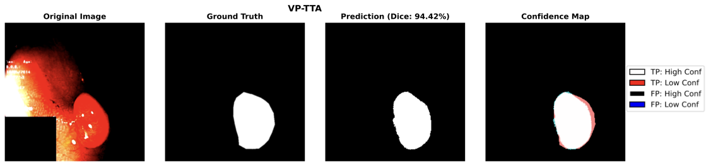
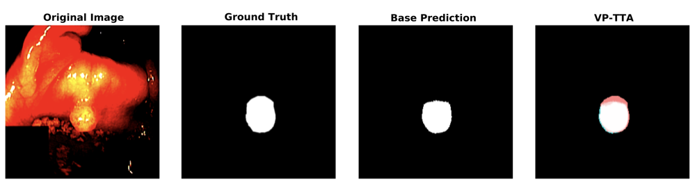

# TTA for Task Shift on Kvasir

Test-time adaptation (TTA) for polyp segmentation, built on **NA-SegFormer**, a hybrid Transformer + CNN model for colonoscopic polyp segmentation. This project retrains NA-SegFormer from scratch and systematically evaluates five TTA families under in-distribution, domain-shift, and task-shift conditions across the Kvasir dataset family, including three novel TTA variants I designed.

Full methodology, hyperparameter sweeps, and complete results tables are written up in *"Better Segments at Test Time: Evaluating Test Time Adaptation Techniques for NA-SegFormer."*

**Stack:** PyTorch, Transformers (attention/LayerNorm internals), CNNs, medical image segmentation, entropy-minimization and prompt-based test-time adaptation.

## Why this exists

Most polyp segmentation research chases architectural gains. Far less work asks whether an already state-of-the-art model can be pushed further at inference time, with no labels and no retraining. This project answers that question directly: it takes NA-SegFormer (94.30% Dice on Kvasir-SEG) and stress-tests it against five TTA techniques across same-domain, cross-domain, and cross-task test conditions, something no prior work on this dataset family had done.

## What's implemented

**Baseline**
- `train_source.py`, `simple_naformer.py`, `networks/TSFormer.py`, `networks/segformer.py` — NA-SegFormer reimplemented from the NAFormer reference codebase, including the Convolutional Block Attention module and the Unified Focal Loss training procedure, neither of which shipped in the original authors' code.

**TTA techniques**
- **Plain TTA** — geometric augmentation ensembling (flips, rotations) with inverse-transformed logit averaging.
- **Tent** (`tent_naformer.py`) — entropy-minimization adaptation, ported from BatchNorm to LayerNorm updates so it works on a Transformer backbone instead of a CNN.
- **TestFit** (`testfit_naformer.py`) — dual-network (frozen teacher / trainable student) adaptation with entropy-min/entropy-max logit fusion and confidence-weighted pseudo-labeling.
- **VP-TTA** (`vptta_naformer.py`) — Visual Prompt TTA: a low-frequency Fourier prompt optimized per-image against BatchNorm statistic-matching loss, with a memory bank for prompt initialization. Backbone stays fully frozen.
- **CF-Geo-VPTTA** (`cf_geo_vptta_naformer.py`) — a new extension combining VP-TTA with geometric augmentation and confidence-based filtering of unreliable adapted views. Also includes the Geo-VPTTA and CF-VPTTA ablations of this variant.

**Evaluation**
- `test_naformer.py` — Dice/IoU evaluation harness.
- `visualize_all_tta_complete.py` — qualitative comparison of predictions and confidence maps across all methods.
- `analyze_tta_results.py` — aggregates Dice/IoU uplift and runtime overhead into the result tables.

## Results at a glance



VP-TTA's prediction (94.42% Dice) against ground truth, with a confidence map breaking out true/false positives by high/low confidence. Most of the mask is high-confidence true positive (white); disagreement concentrates at the polyp boundary, where segmentation is hardest and annotations are noisiest.



Evaluated on Kvasir-SEG, Kvasir-Instrument, and KvasirCapsule-SEG under a unified protocol, with every reported number averaged over 3 runs.

**In-distribution Dice uplift over baseline:**

| Method | Kvasir-SEG | Kvasir-Instrument | KvasirCapsule-SEG |
|---|---|---|---|
| Plain TTA | +3.15 | -1.90 | -0.82 |
| Tent | +0.00 | +0.00 | +0.00 |
| TestFit | +0.02 | +0.04 | +0.00 |
| **VP-TTA** | +0.01 | **+0.07** | **+0.01** |
| CF-Geo-VPTTA (this work) | **+3.46** | -1.74 | -1.00 |

- **VP-TTA is the only technique that improves every dataset**, including cases where the baseline is already near saturated (95%+ Dice on KvasirCapsule-SEG).
- **Tent essentially does nothing** on this architecture. Its LayerNorm adaptation gives negligible signal, despite being the cheapest technique to run.
- **Plain TTA and this work's geometric variants win big on Kvasir-SEG but actively hurt performance under domain shift**, showing that augmentation-only robustness doesn't transfer.
- Under combined domain-shift and task-shift (train on polyps, test on instruments, or vice versa), **VP-TTA is the only method that reliably still helps**, delivering up to +17 Dice points when adapting a KvasirCapsule-SEG-trained model back to Kvasir-SEG.

Full breakdown including cross-dataset domain/task-shift tables and per-method compute overhead is in the accompanying paper (Tables 1 through 4).

## Setup

```bash
pip install -r requirements.txt
```

Requires PyTorch (not pinned in `requirements.txt`, install the CUDA build matching your hardware) plus `einops`, `timm`, `medpy`, `opencv-python`, and `batchgenerators` for segmentation-specific ops.

## Usage

```bash
# Train the NA-SegFormer baseline on a given dataset
python train_source.py

# Evaluate the frozen baseline
python test_naformer.py

# Run a specific TTA technique at test time
python tent_naformer.py
python testfit_naformer.py
python vptta_naformer.py
python cf_geo_vptta_naformer.py

# Aggregate results / generate qualitative figures
python analyze_tta_results.py
python visualize_all_tta_complete.py
```

Dataset configuration and paths live in `dataloaders/POLYP_dataloader.py` and `config.py`; splits used in the paper are a static 70/15/15 train/val/test per dataset.

## Datasets

- **Kvasir-SEG** — 1000 colonoscopy polyp images with pixel-wise masks.
- **Kvasir-Instrument** — 590 images of GI endoscopic tools, used here as a task-shift target (segment tools instead of polyps).
- **KvasirCapsule-SEG** — 55 capsule-endoscopy polyp images, used as a domain-shift target (same task, different imaging modality).

## Repo layout

```
networks/       NA-SegFormer architecture (Transformer encoder + CNN decoder)
dataloaders/    Kvasir dataset loading and CSV split handling
utils/          prompt (Fourier prompt), memory (VP-TTA memory bank), metrics, misc
models/         per-dataset checkpoints (gitignored contents, structure kept)
*_naformer.py   one script per TTA method, runnable standalone against a trained checkpoint
```

## Contact

Please feel free to reach out to me at aaron@bateni.org.
